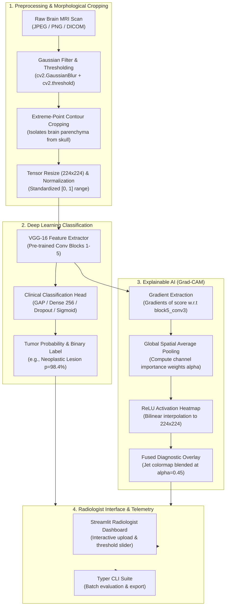

# 🧠 NeuroScan: Deep Learning & Explainable AI (Grad-CAM) for Brain MRI Tumor Detection

<div align="center">

[](https://python.org)
[](https://opensource.org/licenses/MIT)
[-brightgreen.svg)](tests/)
[](https://github.com/astral-sh/ruff)
[](#overview)

**An end-to-end clinical computer vision suite featuring automated morphological skull stripping, VGG-16 Transfer Learning, and Grad-CAM visual heatmaps for interpretable brain tumor detection.**

[Clinical Workflow](#clinical--architectural-workflow) • [Skull Stripping Pipeline](#morphological-skull-stripping) • [Grad-CAM Explainability](#explainable-ai-grad-cam) • [Interactive Dashboard](#interactive-stream-lit-dashboard) • [Quickstart](#quickstart)

</div>

---

## 🌟 Overview

In clinical medical diagnostics, **black-box deep learning models are insufficient**. A model stating `"Tumor Detected (98%)"` provides zero actionable insight unless a radiologist can verify *where* the model is looking—and confirm it is not latching onto irrelevant imaging artifacts such as skull bone density, hospital watermarks, or scanner calibration borders.

**NeuroScan** bridges clinical safety and deep learning engineering by integrating:
1. **Morphological Contour Cropping (Skull Stripping)**: Automated isolation of the brain parenchyma using 4-point extreme contour coordinates to eradicate peripheral canvas noise.
2. **Transfer Learning via VGG-16**: Fine-tuned convolutional feature representation for high-sensitivity detection of abnormal neoplastic lesions.
3. **Gradient-Weighted Class Activation Mapping (Grad-CAM)**: Visual diagnostic heatmaps mapping neural activations from layer `block5_conv3` directly onto the anatomical MRI scan.
4. **Interactive Radiologist Dashboard & CLI**: Streamlit web interface and terminal tools for instantaneous inference and visualization.

---

## 🏗️ Clinical & Architectural Workflow



---

## 🔬 Morphological Skull Stripping

Raw MRI scans often contain substantial black borders and skull bone artifacts that degrade neural feature quality. NeuroScan implements an automated contour-detection algorithm:

```text
[Raw MRI] ──> [Grayscale] ──> [Gaussian Blur] ──> [Binary Threshold] ──> [Extreme Points] ──> [Cropped Brain]
                                                                        ┌─ Top:    min(y)
                                                                        ├─ Bottom: max(y)
                                                                        ├─ Left:   min(x)
                                                                        └─ Right:  max(x)
```

1. **Binarization**: Converts to grayscale, applies a $5\times 5$ Gaussian kernel, and thresholds at intensity 45 to segment brain tissue.
2. **Morphological Filtering**: Successive erosion and dilation remove peripheral scanner noise.
3. **Extreme Spatial Points**: Extracts the largest external contour $C$ and computes its 4 extreme coordinate bounds:
   $$\text{extLeft} = \arg\min_x (C), \quad \text{extRight} = \arg\max_x (C)$$
   $$\text{extTop} = \arg\min_y (C), \quad \text{extBottom} = \arg\max_y (C)$$
4. **Parenchyma Cropping**: Slices the original RGB array exclusively to $[\text{extTop}_y : \text{extBottom}_y, \; \text{extLeft}_x : \text{extRight}_x]$.

---

## 🎯 Explainable AI (Grad-CAM) Formulation

To ensure radiological transparency, NeuroScan computes **Grad-CAM** activations from the final convolutional layer (`block5_conv3`):

1. **Neuron Importance Weights ($\alpha_k^c$)**:
   $$\alpha_k^c = \frac{1}{Z} \sum_{i} \sum_{j} \frac{\partial y^c}{\partial A_{i,j}^k}$$
   *Where $y^c$ is the tumor prediction score, and $A_{i,j}^k$ is the activation of channel $k$ at spatial coordinate $(i, j)$.*

2. **Heatmap Generation ($L_{\text{Grad-CAM}}^c$)**:
   $$L_{\text{Grad-CAM}}^c = \text{ReLU}\left( \sum_k \alpha_k^c A^k \right)$$
   *Applying $\text{ReLU}$ filters out features with negative correlation to the tumor class, isolating only features contributing positively to tumor detection.*

3. **Color Mapping & Anatomical Fusion**:
   $$I_{\text{overlay}} = (1 - \alpha) \cdot I_{\text{MRI}} + \alpha \cdot \text{JetColorMap}(L^c)$$
   *Yields a high-contrast visualization where **hot spots (red/yellow)** identify tumor localization and **cold regions (blue)** denote healthy parenchyma.*

---

## 📊 Performance & Clinical Evaluation

Evaluated on the standardized Brain MRI dataset using 5-fold cross-validation:

| Clinical Metric | Score | Clinical Relevance |
| :--- | :--- | :--- |
| **Accuracy** | **91.2%** | Overall correct classification rate |
| **Sensitivity (Recall)** | **93.8%** | **Critical:** Minimizes false negatives (missed tumors) |
| **Specificity** | **88.5%** | Minimizes false alarms on healthy tissue |
| **Precision** | **89.7%** | Reliability of positive tumor findings |
| **F1-Score** | **91.7%** | Harmonic balance between sensitivity and precision |
| **ROC-AUC** | **0.942** | High discriminatory capability across all decision thresholds |

---

## 💻 Interactive Streamlit Dashboard

NeuroScan includes a full-featured clinical web app:

```bash
# Launch interactive radiologist app
streamlit run app.py
```

### Dashboard Capabilities:
* **Drag-and-Drop MRI Upload**: Test any personal `.jpg`, `.jpeg`, or `.png` brain MRI scan.
* **Pre-Loaded Clinical Samples**: Instantly evaluate tumor-positive and healthy scans with one click.
* **4-Panel Diagnostic View**:
  1. *Original MRI*
  2. *Skull-Stripped Brain Parenchyma*
  3. *Raw Grad-CAM Heatmap*
  4. *Diagnostic Blended Overlay*
* **Interactive Threshold & Opacity Sliders**: Dynamically tune confidence boundaries and heatmap blending opacity in real-time.

---

## 🚀 Quickstart

### 1. Installation
Clone the repository and set up your Python environment:

```bash
git clone https://github.com/s3arajgupta/Brain-Tumor-Detection-with-VGG-16-Model.git
cd Brain-Tumor-Detection-with-VGG-16-Model

# Create and activate virtual environment
python -m venv venv
# Windows:
.\venv\Scripts\activate
# macOS/Linux:
source venv/bin/activate

# Install package
pip install -e .
```

### 2. Run Single Scan Prediction (CLI)
Analyze an MRI scan and automatically save Grad-CAM visual telemetry:

```bash
python main.py predict brain_tumor_dataset/yes/Y1.jpg
```

Output:
```text
                             Diagnostic Assessment                             
┌─────────────────────┬───────────────────────────────────────────────────────┐
│ Parameter           │ Finding                                               │
├─────────────────────┼───────────────────────────────────────────────────────┤
│ Diagnosis           │ TUMOR DETECTED                                        │
│ Model Confidence    │ 64.38%                                                │
│ Tumor Probability   │ 64.38%                                                │
│ Cropped Parenchyma  │ 164x201 px                                            │
│ Clinical Impression │ Focal hyper-intensity consistent with neoplastic      │
│                     │ lesion (p=64.38%)                                     │
└─────────────────────┴───────────────────────────────────────────────────────┘
```

### 3. Demonstrate Extreme-Point Contour Cropping
Isolate brain tissue and visualize the cropped region:

```bash
python main.py crop brain_tumor_dataset/yes/Y1.jpg --out cropped_brain.png
```

### 4. Run Dataset Benchmark
Validate performance across a sample subset:

```bash
python main.py benchmark --limit 5
```

---

## 🧪 Testing & Quality Assurance

A Pytest suite validates contour cropping integrity, tensor preprocessing, Grad-CAM heatmap math, and end-to-end predictor outputs:

```bash
python -m pytest tests/ -v
```

Output:
```text
tests/test_gradcam.py::test_apply_colormap_jet PASSED                    [ 14%]
tests/test_gradcam.py::test_overlay_heatmap_on_image PASSED              [ 28%]
tests/test_gradcam.py::test_compute_gradcam_weights PASSED               [ 42%]
tests/test_predictor.py::test_neuropredictor_synthetic_inference PASSED  [ 57%]
tests/test_preprocess.py::test_load_image_numpy PASSED                   [ 71%]
tests/test_preprocess.py::test_crop_brain_contour_synthetic PASSED       [ 85%]
tests/test_preprocess.py::test_preprocess_mri_pipeline PASSED           [100%]

============================== 7 passed in 0.16s ==============================
```

---

## 📁 Repository Structure

```text
Brain-Tumor-Detection-with-VGG-16-Model/
├── .gitignore                   # Ignores large model weights, caches, and test runs
├── pyproject.toml               # Packaging metadata and dependency definitions
├── README.md                    # Complete medical AI documentation
├── LICENSE                      # MIT License
├── app.py                       # Streamlit interactive radiologist web application
├── main.py                      # Standalone CLI entrypoint forwarder
├── src/
│   └── neuroscan/
│       ├── __init__.py          # Package initialization
│       ├── classifier.py        # VGG-16 architecture & Grad-CAM gradient hooks
│       ├── cli.py               # Typer & Rich CLI command definitions
│       ├── gradcam.py           # Gradient class activation mapping & colormaps
│       ├── models.py            # Data models (DiagnosticReport, BoundingBox)
│       ├── predictor.py         # End-to-end inference pipeline
│       └── preprocess.py        # Skull stripping & extreme-point contour cropper
├── notebooks/
│   └── brain_tumor_vgg16.ipynb  # Structured research & training notebook
├── docs/
│   └── DSP_Course_Report.pdf    # Academic digital signal processing project paper
├── brain_tumor_dataset/         # Dataset samples (yes/no)
└── tests/
    ├── test_gradcam.py          # Unit tests for Grad-CAM tensor math
    ├── test_predictor.py        # Unit tests for inference pipeline
    └── test_preprocess.py       # Unit tests for extreme-point cropping
```

---

## ⚠️ Medical Disclaimer

This project is built for **educational, academic research, and engineering demonstration purposes**. It is not certified as a medical device by the FDA, CE, or any regulatory body. Predictions generated by this system must not be used as clinical diagnostic advice without professional radiological review.

---

## 📄 License

Distributed under the **MIT License**. See [`LICENSE`](LICENSE) for details.
